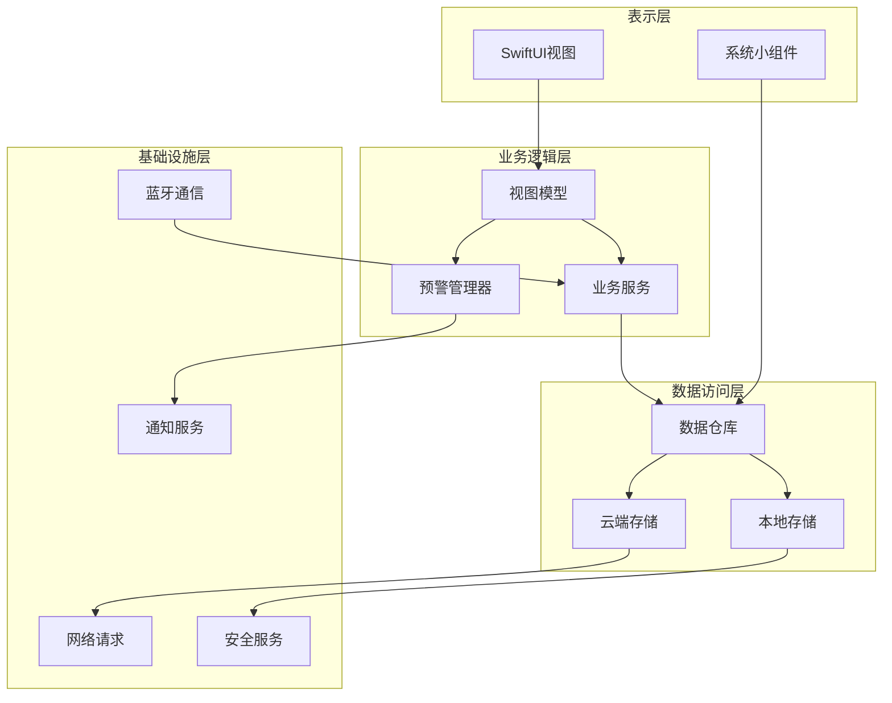
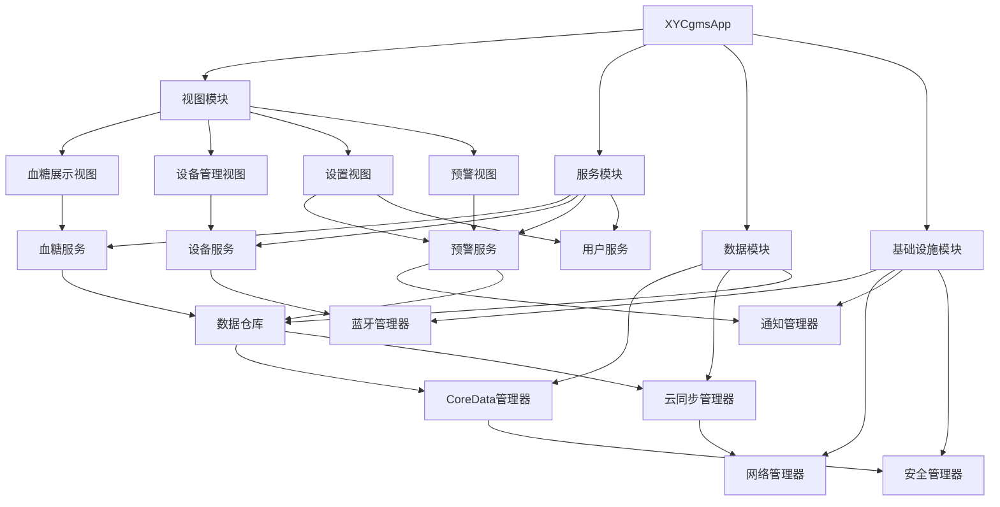
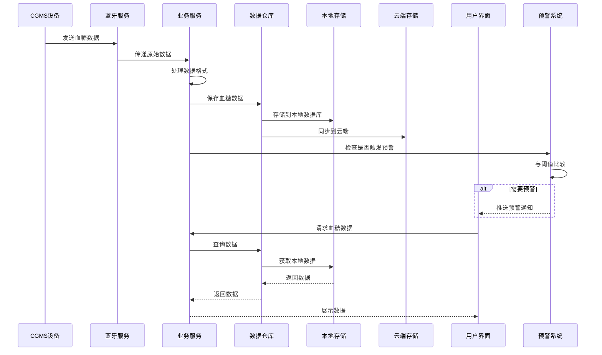

# XYCgmsApp 系统架构设计文档

## 1. 整体架构设计

### 1.1 架构概述

XYCgmsApp采用模块化、分层的架构设计，基于Swift和SwiftUI构建，支持iOS、iPadOS、macOS和watchOS多平台运行。系统分为四个主要层次，每层职责清晰，耦合度低，便于开发、测试和维护。

### 1.2 整体架构图



## 2. 分层设计

### 2.1 表示层 (Presentation Layer)

表示层负责用户界面的渲染和用户交互的处理，基于SwiftUI框架实现，具有良好的跨平台适配能力。

**核心组件：**
- **主视图**: 血糖数据展示、设备连接状态、预警信息等核心内容的展示
- **详情视图**: 血糖数据详情、历史记录、统计分析等
- **设置视图**: 设备管理、预警阈值设置、用户偏好设置等
- **小组件**: 在iOS/macOS主屏幕或通知中心展示关键信息

**设计原则：**
- 采用MVVM模式，视图与业务逻辑分离
- 使用响应式设计，自动适应不同屏幕尺寸
- 关注可访问性，支持VoiceOver等辅助功能

### 2.2 业务逻辑层 (Business Logic Layer)

业务逻辑层包含应用的核心业务规则和流程控制，协调各功能模块的工作。

**核心组件：**
- **视图模型 (ViewModel)**: 连接UI和业务逻辑，处理状态管理和数据流
- **血糖服务 (GlucoseService)**: 处理血糖数据的计算、分析和业务规则
- **设备服务 (DeviceService)**: 管理CGMS设备连接和通信
- **预警管理器 (AlertManager)**: 实现预警逻辑和通知触发

**设计原则：**
- 单一职责原则，每个服务专注于特定功能
- 依赖注入模式，提高代码可测试性
- 响应式编程，使用Combine框架处理异步事件

### 2.3 数据访问层 (Data Access Layer)

数据访问层负责数据的持久化存储和检索，包括本地存储和云端存储。

**核心组件：**
- **数据仓库 (Repository)**: 统一的数据访问接口，隐藏底层存储细节
- **本地存储 (LocalStorage)**: 管理Core Data实体和本地数据操作
- **云端存储 (CloudStorage)**: 处理与远程服务器的数据同步

**设计原则：**
- 仓储模式，隔离数据源变更
- 离线优先，确保应用在无网络环境下仍能正常工作
- 数据加密，保护敏感健康数据

### 2.4 基础设施层 (Infrastructure Layer)

基础设施层提供应用所需的基础服务和技术支持，为上层提供统一的接口。

**核心组件：**
- **蓝牙通信 (BLEService)**: 基于Core Bluetooth实现与CGMS设备的通信
- **网络请求 (NetworkService)**: 封装URLSession，处理网络通信
- **通知服务 (NotificationService)**: 管理本地和远程通知
- **安全服务 (SecurityService)**: 提供数据加密、解密和安全存储功能

**设计原则：**
- 抽象接口，隔离平台特定实现
- 错误处理和重试机制
- 资源优化，减少电量和数据消耗

## 3. 模块依赖关系图



## 4. 核心接口定义

### 4.1 设备通信接口

```swift
// BLE通信服务接口
protocol BLEServiceProtocol {
    func startScan()
    func stopScan()
    func connect(to peripheral: Peripheral)
    func disconnect(from peripheral: Peripheral)
    func readGlucoseData() -> AnyPublisher<GlucoseData, BLEError>
    var connectedPeripheral: AnyPublisher<Peripheral?, Never> { get }
}
```

### 4.2 数据模型接口

```swift
// 血糖数据模型
struct GlucoseData {
    let timestamp: Date
    let value: Double // 血糖值，单位：mmol/L
    let isHighAlert: Bool
    let isLowAlert: Bool
}

// 设备信息模型
struct DeviceInfo {
    let id: String
    let name: String
    let firmwareVersion: String
    let batteryLevel: Int
    let signalStrength: Int
}
```

### 4.3 数据访问接口

```swift
// 数据仓库接口
protocol GlucoseRepositoryProtocol {
    func saveGlucoseData(_ data: GlucoseData) -> AnyPublisher<Void, Error>
    func getGlucoseData(startDate: Date, endDate: Date) -> AnyPublisher<[GlucoseData], Error>
    func getLatestGlucoseData() -> AnyPublisher<GlucoseData?, Error>
    func exportGlucoseData(format: ExportFormat) -> AnyPublisher<URL, Error>
}

// 云同步接口
protocol CloudSyncProtocol {
    func syncData() -> AnyPublisher<SyncResult, Error>
    func setSyncFrequency(_ frequency: TimeInterval)
    var isSyncing: AnyPublisher<Bool, Never> { get }
}
```

### 4.4 预警系统接口

```swift
// 预警设置模型
struct AlertSettings {
    let highThreshold: Double
    let lowThreshold: Double
    let alertSoundEnabled: Bool
    let alertVibrationEnabled: Bool
    let alertNotificationEnabled: Bool
}

// 预警服务接口
protocol AlertServiceProtocol {
    func checkAlert(_ glucoseData: GlucoseData) -> AnyPublisher<Alert?, Never>
    func updateSettings(_ settings: AlertSettings)
    func getSettings() -> AlertSettings
    var alerts: AnyPublisher<[Alert], Never> { get }
}
```

## 5. 数据流向图



## 6. 异常处理策略

### 6.1 错误类型定义

```swift
enum AppError: Error {
    case bluetoothError(String)
    case networkError(String)
    case storageError(String)
    case validationError(String)
    case deviceError(String)
    case unknownError(String)
}
```

### 6.2 异常处理原则

1. **错误捕获与转换**
   - 底层错误（如蓝牙、网络、存储）转换为应用级错误
   - 提供友好的错误描述和恢复建议

2. **重试机制**
   - 蓝牙连接失败自动重试
   - 网络请求失败指数退避重试
   - 同步操作失败队列管理

3. **错误状态管理**
   - 使用SwiftUI的错误状态绑定
   - 提供清晰的错误提示UI
   - 记录错误日志用于分析

4. **用户反馈**
   - 关键错误通过通知提示用户
   - 非关键错误可在界面中显示
   - 提供重试和解决建议

### 6.3 特定场景异常处理

#### 蓝牙连接异常
- 自动重连策略：连接失败后，间隔10秒、30秒、60秒自动重试
- 连接超时：超过1分钟未连接成功，提示用户检查设备状态
- 通信中断：设备断开连接时，立即通知用户并尝试重连

#### 数据同步异常
- 离线模式：网络不可用时，数据缓存到本地，待网络恢复后同步
- 同步冲突：实现数据版本控制，解决冲突
- 同步失败：记录失败原因，提供手动同步选项

#### 数据完整性异常
- 数据验证：对接收的血糖数据进行有效性检查
- 异常值处理：识别并标记可能的异常数据点
- 数据恢复：提供数据备份和恢复功能

## 7. 跨平台适配设计

### 7.1 平台特性抽象

| 平台 | 屏幕特性 | 交互方式 | 特殊功能 |
|------|----------|----------|----------|
| iOS | 小屏，触控优先 | 手势操作，触摸输入 | 推送通知，HealthKit集成 |
| iPadOS | 大屏，触控+键盘 | 多任务，拖放操作 | 分屏显示，键盘快捷键 |
| macOS | 大屏，鼠标+键盘 | 精确操作，快捷键 | 菜单系统，Dock集成 |
| watchOS | 极小屏，触控+表冠 | 轻量级交互，快速操作 | 手腕抬升，触觉反馈 |

### 7.2 适配策略

1. **布局适配**
   - 使用SwiftUI的自适应布局
   - 定义不同屏幕尺寸的布局变体
   - 实现组件的拉伸和缩放规则

2. **功能适配**
   - 核心功能在所有平台保持一致
   - 针对平台特性提供增强功能
   - 考虑平台使用场景优化交互

3. **代码复用策略**
   - 核心业务逻辑共享
   - 视图模型跨平台使用
   - 平台特定功能通过条件编译实现

```swift
// 平台特定代码示例
#if os(iOS)
    // iOS特定实现
#elseif os(macOS)
    // macOS特定实现
#elseif os(watchOS)
    // watchOS特定实现
#endif
```

## 8. 安全设计

### 8.1 数据安全

- **本地数据加密**：使用CommonCrypto对敏感数据加密存储
- **传输加密**：所有网络通信使用HTTPS/TLS加密
- **数据访问控制**：实现应用内权限管理
- **数据脱敏**：日志记录时对敏感信息脱敏

### 8.2 认证与授权

- **设备认证**：蓝牙设备配对认证
- **用户认证**：可选的应用内身份验证
- **系统权限请求**：合理请求蓝牙、通知等系统权限

### 8.3 隐私保护

- **数据最小化**：仅收集必要的数据
- **用户控制**：提供数据共享和删除选项
- **合规性**：确保符合健康数据相关隐私法规

## 9. 性能优化

### 9.1 内存管理

- 使用Swift的内存管理特性
- 避免循环引用
- 及时释放大型资源

### 9.2 电池优化

- 优化蓝牙扫描频率
- 合理使用后台处理
- 网络请求批处理

### 9.3 启动优化

- 延迟加载非关键功能
- 预加载必要资源
- 优化Core Data初始化

---

本文档详细描述了XYCgmsApp的系统架构设计，包括分层设计、核心组件、接口定义、数据流向和异常处理策略。该设计确保了应用的可扩展性、可维护性和跨平台兼容性，为后续的开发工作提供了清晰的指导。