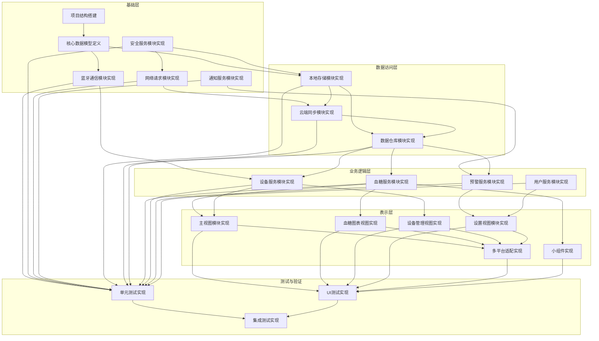

# XYCgmsApp 任务拆分文档

## 1. 任务拆分概述

基于系统架构设计，将XYCgmsApp项目拆分为以下主要模块，每个模块包含若干原子任务。任务遵循高内聚、低耦合原则，确保每个任务可独立实现和测试。

## 2. 核心任务列表

### 2.1 项目基础架构任务

#### TASK-001: 项目结构搭建
- **输入契约**: 无
- **输出契约**: 
  - 多平台Xcode项目结构
  - 基本的SwiftUI应用骨架
  - 项目依赖配置
- **实现约束**:
  - 使用Swift 5.5+
  - 使用SwiftUI 3.0+
  - 支持iOS 15+, iPadOS 15+, macOS 12+, watchOS 8+
- **依赖关系**: 无

#### TASK-002: 核心数据模型定义
- **输入契约**: 系统设计文档中的数据模型接口定义
- **输出契约**:
  - GlucoseData模型
  - DeviceInfo模型
  - AlertSettings模型
  - 相关枚举和辅助类型
- **实现约束**:
  - 使用Swift的Codable协议
  - 确保模型的线程安全性
- **依赖关系**: 无

### 2.2 基础设施层任务

#### TASK-003: 蓝牙通信模块实现
- **输入契约**: BLE通信服务接口定义
- **输出契约**:
  - BLEService类
  - 设备扫描与连接功能
  - 血糖数据接收功能
- **实现约束**:
  - 使用Core Bluetooth框架
  - 实现自动重连机制
  - 支持后台模式
- **依赖关系**: TASK-002

#### TASK-004: 安全服务模块实现
- **输入契约**: 安全服务接口定义
- **输出契约**:
  - SecurityService类
  - 数据加密/解密功能
  - 安全存储功能
- **实现约束**:
  - 使用CommonCrypto框架
  - 实现安全的密钥管理
- **依赖关系**: 无

#### TASK-005: 网络请求模块实现
- **输入契约**: 网络请求服务接口定义
- **输出契约**:
  - NetworkService类
  - 基础HTTP请求功能
  - 错误处理与重试机制
- **实现约束**:
  - 使用URLSession
  - 支持JSON序列化/反序列化
- **依赖关系**: TASK-004

#### TASK-006: 通知服务模块实现
- **输入契约**: 通知服务接口定义
- **输出契约**:
  - NotificationService类
  - 本地通知功能
  - 通知权限管理
- **实现约束**:
  - 使用UserNotifications框架
  - 支持不同平台的通知特性
- **依赖关系**: 无

### 2.3 数据访问层任务

#### TASK-007: 本地存储模块实现
- **输入契约**: Core Data模型定义
- **输出契约**:
  - CoreDataManager类
  - 数据持久化功能
  - 数据查询与过滤功能
- **实现约束**:
  - 使用Core Data框架
  - 支持后台上下文
- **依赖关系**: TASK-002, TASK-004

#### TASK-008: 云端同步模块实现
- **输入契约**: 云同步接口定义
- **输出契约**:
  - CloudSyncManager类
  - 数据同步功能
  - 离线缓存管理
- **实现约束**:
  - 实现增量同步
  - 处理同步冲突
- **依赖关系**: TASK-005, TASK-007

#### TASK-009: 数据仓库模块实现
- **输入契约**: 数据仓库接口定义
- **输出契约**:
  - GlucoseRepository类
  - 统一数据访问接口
  - 数据导出功能
- **实现约束**:
  - 使用Combine框架处理异步数据流
  - 提供模拟数据支持测试
- **依赖关系**: TASK-007, TASK-008

### 2.4 业务逻辑层任务

#### TASK-010: 血糖服务模块实现
- **输入契约**: 血糖服务接口定义
- **输出契约**:
  - GlucoseService类
  - 血糖数据分析功能
  - 统计计算功能
- **实现约束**:
  - 使用响应式编程模式
  - 确保计算准确性
- **依赖关系**: TASK-009

#### TASK-011: 设备服务模块实现
- **输入契约**: 设备服务接口定义
- **输出契约**:
  - DeviceService类
  - 设备连接管理
  - 设备信息查询
- **实现约束**:
  - 处理设备连接状态
  - 提供设备操作API
- **依赖关系**: TASK-003, TASK-009

#### TASK-012: 预警服务模块实现
- **输入契约**: 预警服务接口定义
- **输出契约**:
  - AlertService类
  - 预警规则检查
  - 预警历史管理
- **实现约束**:
  - 支持自定义阈值
  - 实时预警检测
- **依赖关系**: TASK-006, TASK-009

#### TASK-013: 用户服务模块实现
- **输入契约**: 用户服务接口定义
- **输出契约**:
  - UserService类
  - 用户偏好管理
  - 应用设置存储
- **实现约束**:
  - 使用UserDefaults存储设置
  - 支持设置同步
- **依赖关系**: 无

### 2.5 表示层任务

#### TASK-014: 主视图模块实现
- **输入契约**: 血糖数据模型和视图模型
- **输出契约**:
  - 主界面视图
  - 实时数据显示
  - 连接状态指示
- **实现约束**:
  - 使用SwiftUI构建
  - 支持响应式更新
- **依赖关系**: TASK-010, TASK-011

#### TASK-015: 血糖图表视图实现
- **输入契约**: 血糖数据和图表配置
- **输出契约**:
  - 血糖曲线图视图
  - 多时间维度切换
  - 异常值标记
- **实现约束**:
  - 使用Charts框架(iOS 16+)
  - 支持缩放和平移操作
- **依赖关系**: TASK-010

#### TASK-016: 设备管理视图实现
- **输入契约**: 设备服务和视图模型
- **输出契约**:
  - 设备扫描列表
  - 设备连接管理界面
  - 设备信息显示
- **实现约束**:
  - 适配不同屏幕尺寸
  - 提供明确的用户指引
- **依赖关系**: TASK-011

#### TASK-017: 设置视图模块实现
- **输入契约**: 用户服务和预警服务
- **输出契约**:
  - 设置界面视图
  - 预警阈值配置
  - 用户偏好设置
- **实现约束**:
  - 表单验证
  - 提供默认值
- **依赖关系**: TASK-012, TASK-013

#### TASK-018: 多平台适配实现
- **输入契约**: 各平台视图组件
- **输出契约**:
  - 平台特定适配代码
  - 响应式布局适配
  - 平台特有功能
- **实现约束**:
  - 使用条件编译
  - 遵循平台设计规范
- **依赖关系**: TASK-014, TASK-015, TASK-016, TASK-017

#### TASK-019: 小组件实现
- **输入契约**: 数据仓库和图表组件
- **输出契约**:
  - iOS/macOS小组件
  - watchOS复杂功能
  - 快捷操作入口
- **实现约束**:
  - 遵循各平台小组件规范
  - 优化资源使用
- **依赖关系**: TASK-009, TASK-010

### 2.6 测试与验证任务

#### TASK-020: 单元测试实现
- **输入契约**: 各模块代码
- **输出契约**:
  - 单元测试套件
  - 关键路径测试用例
  - 边界条件测试
- **实现约束**:
  - 使用XCTest框架
  - 代码覆盖率≥80%
- **依赖关系**: TASK-003至TASK-013

#### TASK-021: UI测试实现
- **输入契约**: 视图组件
- **输出契约**:
  - UI测试用例
  - 交互流程测试
  - 多平台UI一致性验证
- **实现约束**:
  - 使用XCTest UI测试
  - 覆盖主要用户流程
- **依赖关系**: TASK-014至TASK-019

#### TASK-022: 集成测试实现
- **输入契约**: 完整应用
- **输出契约**:
  - 集成测试套件
  - 端到端测试用例
  - 性能测试报告
- **实现约束**:
  - 模拟CGMS设备输入
  - 验证数据流向正确性
- **依赖关系**: TASK-020, TASK-021

## 3. 任务依赖图

## 4. 任务执行计划

### 4.1 迭代规划

| 迭代 | 持续时间 | 包含任务 | 主要目标 |
|------|----------|----------|----------|
| 迭代1 | 2周 | TASK-001, TASK-002, TASK-003, TASK-004 | 完成基础架构和核心组件 |
| 迭代2 | 2周 | TASK-005, TASK-006, TASK-007, TASK-008 | 完成数据层和基础设施 |
| 迭代3 | 2周 | TASK-009, TASK-010, TASK-011, TASK-012, TASK-013 | 完成业务逻辑层 |
| 迭代4 | 2周 | TASK-014, TASK-015, TASK-016, TASK-017 | 完成基本UI和用户交互 |
| 迭代5 | 1周 | TASK-018, TASK-019 | 完成多平台适配和扩展功能 |
| 迭代6 | 1周 | TASK-020, TASK-021, TASK-022 | 完成测试和验证 |

### 4.2 风险与缓解

| 风险 | 影响 | 缓解策略 |
|------|------|----------|
| 蓝牙连接稳定性 | 高 | 实现健壮的重连机制和错误处理 |
| 跨平台适配复杂性 | 中 | 采用渐进式适配，先完成一个平台再扩展 |
| 数据安全合规性 | 高 | 早期引入安全审查，咨询法律专家 |
| 测试环境限制 | 中 | 使用模拟设备和数据进行测试 |

---

本文档将作为项目开发的任务分解和执行指南，各任务的具体实现细节将在实际开发过程中进一步细化。任务的执行顺序将按照依赖关系和迭代规划进行，确保项目稳步推进。