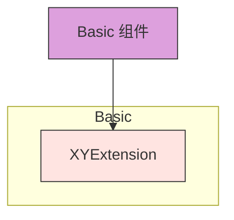
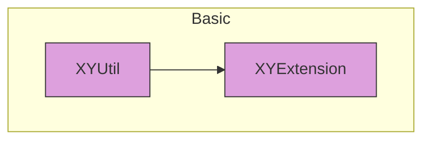

# Basic Components

Basic 组件包含 XYLib 的基础模块和核心扩展，是其他所有组件的基础依赖。

## 组件列表

### XYExtension
提供 Swift/KVC/KVO 等扩展工具集，增强系统功能。

## 架构图



## 依赖关系

Basic 组件是 XYLib 的最底层组件，不依赖其他组件：



## 功能特点

- 提供常用的 Swift 扩展功能
- 封装 KVC/KVO 相关的便捷方法
- 为上层组件提供基础支持

## 使用说明

Basic 组件作为 XYLib 的基础依赖，通常被其他高级组件所依赖，不建议直接在业务项目中单独使用。

## 安装

通过 CocoaPods 安装：

```ruby
pod 'XYExtension'
```