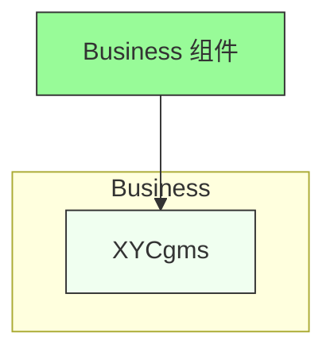
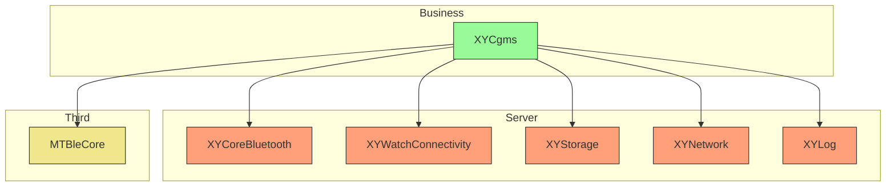

# Business Components

Business 组件包含 XYLib 的核心业务逻辑实现，通常依赖于 Server 和 Basic 组件。

## 组件列表

### XYCgms
核心业务管理服务模块（可能为 CGMS 连续血糖监测相关），实现具体业务逻辑。

## 架构图



## 依赖关系

XYCgms 组件依赖于多个下层组件：



## 功能特点

- 实现核心业务逻辑
- 依赖基础服务组件
- 提供业务相关的 API 接口

## 使用说明

Business 组件实现具体的业务功能，通常在应用程序中直接使用。

## 安装

通过 CocoaPods 安装：

```ruby
pod 'XYCgms'
```