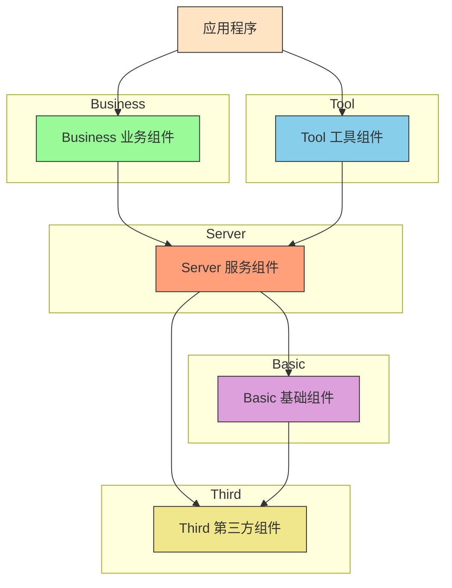
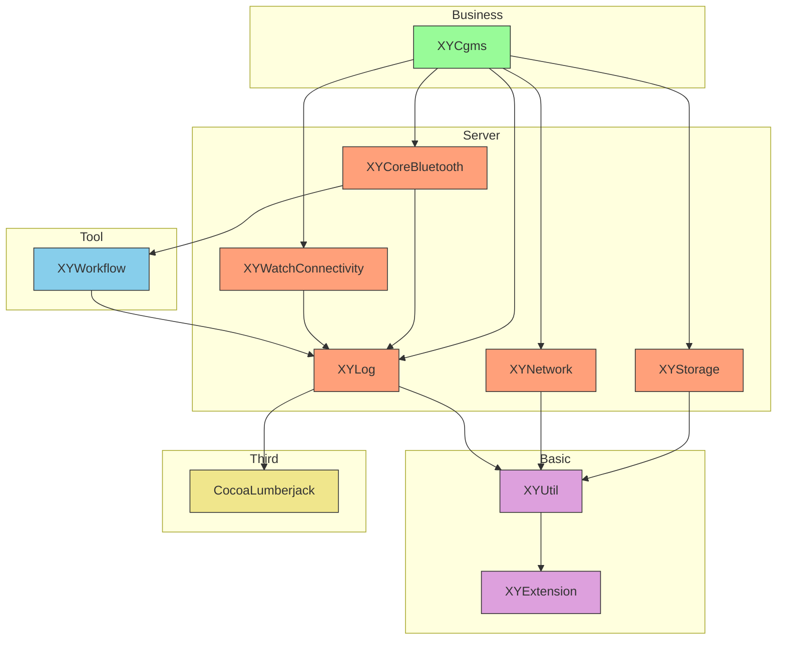

# XYLib

XYLib 是一个 iOS/macOS 平台的私有库集合，主要用于模块化开发，支持蓝牙通信、日志记录、网络请求、数据存储等基础功能。

## 架构说明

XYLib 采用分层架构设计，将功能模块按职责划分为以下五个类别：

- **Basic（基础组件）** - 核心扩展和基础工具
- **Business（业务组件）** - 核心业务逻辑实现
- **Server（服务组件）** - 基础服务封装
- **Tool（工具组件）** - 通用工具模块
- **Third（第三方组件）** - 第三方库依赖管理

## 架构图

## 组件依赖关系

基于各组件 podspec 文件中的依赖关系，整理出以下依赖图：

## 组件分类

### Basic（基础组件）
包含最基础的扩展和核心工具，是其他所有组件的基础依赖。

### Business（业务组件）
实现具体业务逻辑的组件，通常依赖于Server和Basic组件。

### Server（服务组件）
封装基础服务功能，如网络请求、蓝牙通信、日志系统、数据存储等。

### Tool（工具组件）
通用工具模块，提供工作流管理、节点操作等功能。

### Third（第三方组件）
第三方库的封装和管理，统一依赖版本控制。

## 安装

各个组件通过 CocoaPods 进行管理，可通过 podspec 单独引用。

## 技术栈

- **语言**: Swift/Objective-C 混合开发
- **构建工具**: Xcode
- **依赖管理**: CocoaPods
- **支持平台**: iOS/macOS/watchOS

## 开发环境

- Xcode (支持 Swift 和 Objective-C)
- CocoaPods (>=1.10+)
- macOS 系统