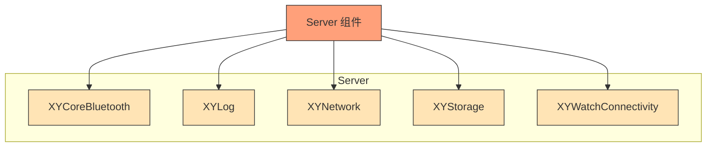
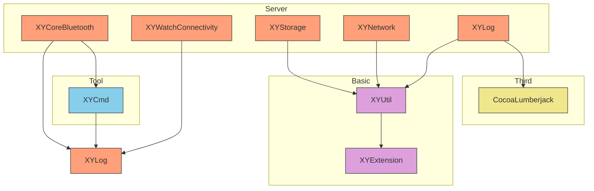

# Server Components

Server 组件封装了 XYLib 的基础服务功能，包括网络请求、蓝牙通信、日志系统、数据存储等。

## 组件列表

### XYCoreBluetooth
封装 CoreBluetooth 功能，用于蓝牙设备通信。

### XYLog
日志系统封装，集成 CocoaLumberjack。

### XYNetwork
网络请求模块，基于 URLSession 或 Alamofire 封装。

### XYStorage
本地数据持久化模块（UserDefaults/Keychain/File）。

### XYWatchConnectivity
Apple Watch 通信支持。

## 架构图



## 依赖关系

Server 组件内部各模块的依赖关系：



## 功能特点

- 提供稳定的基础服务功能
- 高内聚低耦合的设计
- 统一的接口封装，便于使用和维护

## 使用说明

Server 组件为 Business 组件提供基础服务支持，通常不直接在应用程序中使用。

## 安装

各个组件可通过 CocoaPods 单独安装：

```ruby
pod 'XYCoreBluetooth'
pod 'XYLog'
pod 'XYNetwork'
pod 'XYStorage'
pod 'XYWatchConnectivity'
```