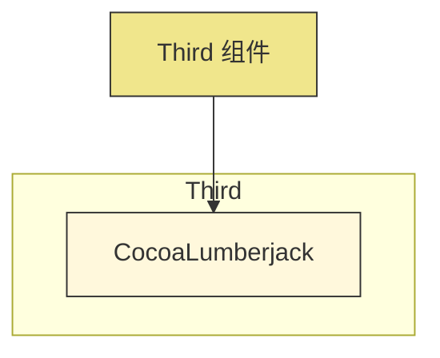
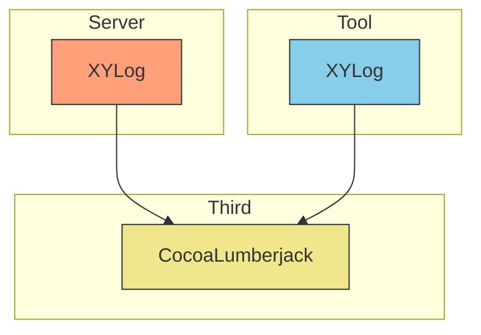

# Third Components

Third 组件用于管理 XYLib 的第三方库依赖，统一依赖版本控制。

## 组件说明

该目录用于存放和管理项目中使用的第三方库，确保各个组件依赖的第三方库版本统一，避免版本冲突。

## 包含的第三方库

目前包含以下第三方库：

- **CocoaLumberjack** - 日志框架

## 架构图

## 依赖关系

Third 组件被 XYLog 组件依赖：

## 功能特点

- 统一管理第三方依赖
- 避免版本冲突
- 简化依赖配置

## 使用说明

Third 组件通过 CocoaPods 管理第三方依赖，其他组件通过依赖 Third 组件来使用第三方库。

## 安装

第三方组件依赖会自动通过 CocoaPods 安装，无需单独配置。