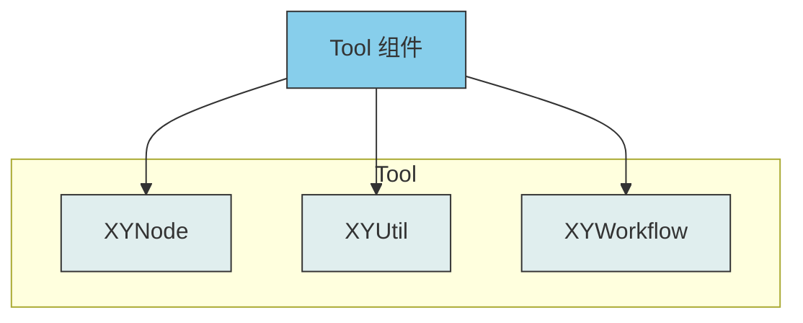
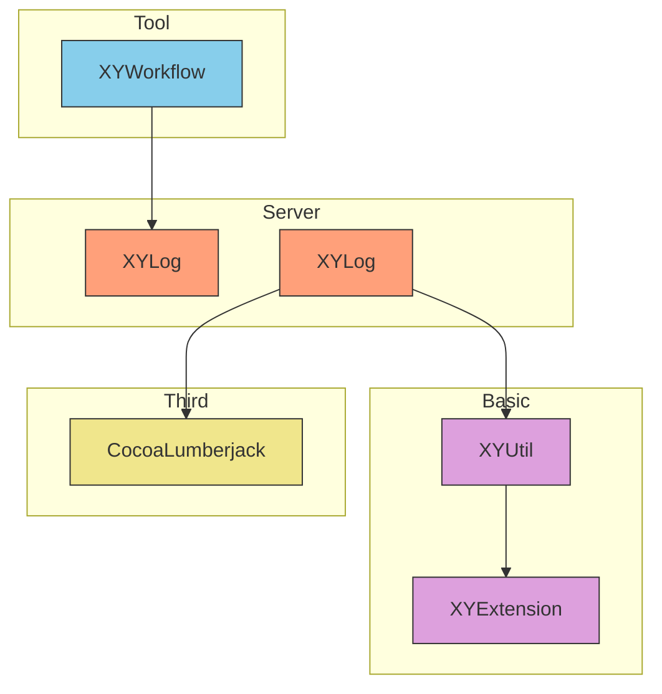

# Tool Components

Tool 组件包含 XYLib 的通用工具模块，提供工作流管理、节点操作等功能。

## 组件列表

### XYNode
节点操作工具模块。

### XYUtil
常用工具类集合（日期、字符串、加密等）。

### XYWorkflow
工作流或状态机管理模块。

## 架构图



## 依赖关系

Tool 组件内部各模块的依赖关系：



## 功能特点

- 提供通用工具功能
- 支持复杂流程控制
- 可复用的工具模块

## 使用说明

Tool 组件提供通用的工具功能，可在各种场景中复用。

## 安装

各个组件可通过 CocoaPods 单独安装：

```ruby
pod 'XYNode'
pod 'XYUtil'
pod 'XYWorkflow'
```