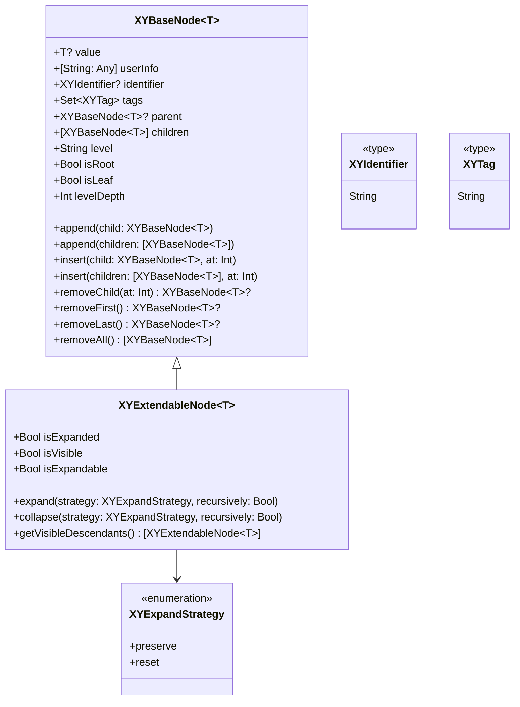

# XYNode

[](https://travis-ci.org/hsf89757/XYNode)
[](https://cocoapods.org/pods/XYNode)
[](https://cocoapods.org/pods/XYNode)
[](https://cocoapods.org/pods/XYNode)

## 目录

<details>
<summary>点击展开目录</summary>

- [XYNode](#xynode)
  - [目录](#目录)
  - [简介](#简介)
  - [特性](#特性)
  - [架构](#架构)
  - [类图](#类图)
  - [核心类](#核心类)
    - [XYBaseNode](#xybasenode)
      - [介绍](#介绍)
      - [特点](#特点)
      - [适用场景](#适用场景)
      - [使用示例](#使用示例)
    - [XYExtendableNode](#xyextendablenode)
      - [介绍](#介绍-1)
      - [特点](#特点-1)
      - [适用场景](#适用场景-1)
      - [使用示例](#使用示例-1)
  - [安装](#安装)
  - [要求](#要求)
  - [作者](#作者)
  - [许可证](#许可证)

</details>

## 简介

XYNode 是一个用于构建和管理树形数据结构的 iOS 框架。它提供了一套灵活且强大的 API，用于创建、操作和遍历节点树。该框架支持节点的增删改查、层级管理、标识符和标签系统、缓存优化等功能，特别适用于需要处理复杂树形结构数据的场景。

主要功能包括：
- 基础树节点操作：创建、添加、删除、查找节点
- 层级管理：自动维护节点层级信息和深度
- 标识符和标签系统：支持通过标识符快速查找节点，通过标签分组管理
- 缓存优化：内置缓存机制提升查找性能
- 可扩展节点：支持展开/收起状态管理，适用于 UI 场景


## 特性

- **基础节点**: [XYBaseNode](#xybasenode) 提供树节点的基本功能
- **可扩展节点**: [XYExtendableNode](#xyextendablenode) 支持展开/收起状态管理
- **层级管理**: 自动维护节点层级信息和深度
- **标识符系统**: 支持通过唯一标识符快速查找节点
- **标签系统**: 支持通过标签对节点进行分组管理
- **缓存优化**: 内置缓存机制提升查找性能
- **跨平台**: 支持 iOS 和 watchOS 平台


## 架构

XYNode 采用面向对象设计，核心组件包括：

1. **XYBaseNode**: 基础树节点类，提供节点的基本操作功能
2. **XYExtendableNode**: 可扩展节点类，继承自 XYBaseNode，增加展开/收起功能

架构特点：
- 面向对象设计，易于扩展和维护
- 支持泛型，可存储任意类型的数据
- 内置缓存机制，提升查找性能
- 支持标识符和标签系统，便于节点管理


## 类图



## 核心类

### XYBaseNode

<details>
<summary>点击查看 XYBaseNode 详情</summary>

#### 介绍

XYBaseNode 是基础树节点类，提供节点的基本操作功能，包括增删改查、层级管理、标识符和标签系统等。

#### 特点

- 支持泛型，可存储任意类型的数据
- 自动维护节点层级信息和深度
- 支持通过唯一标识符快速查找节点
- 支持通过标签对节点进行分组管理
- 内置缓存机制，提升查找性能

#### 适用场景

适用于需要处理树形结构数据的基础场景，如组织架构、文件系统、分类管理等。

#### 使用示例

```swift
// 创建节点
let rootNode = XYBaseNode<String>(value: "Root")
let childNode1 = XYBaseNode<String>(value: "Child 1")
let childNode2 = XYBaseNode<String>(value: "Child 2")

// 添加子节点
rootNode.append(child: childNode1)
rootNode.append(child: childNode2)

// 设置标识符
childNode1.identifier = "child1"

// 设置标签
childNode1.tags.insert("tag1")
childNode2.tags.insert("tag2")

// 查找节点
if let foundNode = rootNode.findNode(by: "child1") {
    print("找到节点: \(foundNode.value ?? "")")
}

// 遍历节点
rootNode.traverse { node in
    print("节点值: \(node.value ?? "")")
}
```

</details>

### XYExtendableNode

<details>
<summary>点击查看 XYExtendableNode 详情</summary>

#### 介绍

XYExtendableNode 是可扩展节点类，继承自 XYBaseNode，增加展开/收起功能，特别适用于 UI 场景。

#### 特点

- 继承 XYBaseNode 的所有功能
- 支持节点展开/收起状态管理
- 提供可见性计算功能
- 支持不同的展开策略

#### 适用场景

适用于需要在 UI 中展示树形结构的场景，如文件浏览器、组织架构图、折叠列表等。

#### 使用示例

```swift
// 创建可扩展节点
let rootNode = XYExtendableNode<String>(value: "Root")
let childNode1 = XYExtendableNode<String>(value: "Child 1")
let childNode2 = XYExtendableNode<String>(value: "Child 2")

// 添加子节点
rootNode.append(child: childNode1)
rootNode.append(child: childNode2)

// 展开节点
rootNode.expand()

// 检查节点是否可见
if childNode1.isVisible {
    print("子节点可见")
}

// 获取可见的后代节点
let visibleDescendants = rootNode.getVisibleDescendants()
for descendant in visibleDescendants {
    print("可见后代节点: \(descendant.value ?? "")")
}
```

</details>

## 安装

XYNode 可通过 [CocoaPods](https://cocoapods.org) 安装。将以下行添加到你的 Podfile：

```ruby
pod 'XYNode'
```

然后运行 `pod install`。


## 要求

| 平台 | 最低版本 |
|------|----------|
| iOS | 14.0+ |
| watchOS | 9.0+ |

依赖库：
| 模块 | 依赖库 | 版本 |
|------|--------|------|
| Basic | XYExtension | 1.0.0 |
| Server | XYLog<br>XYUtil | 1.0.0<br>1.0.0 |
| Tool | / | / |
| Business | / | / |
| Third | / | / |

框架：
- iOS: UIKit, Foundation
- watchOS: WatchKit, Foundation


## 作者

hsf89757, shanfeng.huang@microtechmd.com


## 许可证

XYNode 基于 MIT 许可证发布。有关详细信息，请参见 LICENSE 文件。