# XYUtil

[](https://travis-ci.org/hsf89757/XYUtil)
[](https://cocoapods.org/pods/XYUtil)
[](https://cocoapods.org/pods/XYUtil)
[](https://cocoapods.org/pods/XYUtil)

## 目录

<details>
<summary>点击展开目录</summary>

- [XYUtil](#xyutil)
  - [目录](#目录)
  - [简介](#简介)
  - [架构](#架构)
  - [类图](#类图)
  - [核心类](#核心类)
    - [XYApp](#xyapp)
      - [介绍](#介绍)
      - [特点](#特点)
      - [适用场景](#适用场景)
      - [使用示例](#使用示例)
    - [XYThreadSafeProperty](#xythreadsafeproperty)
      - [介绍](#介绍-1)
      - [特点](#特点-1)
      - [适用场景](#适用场景-1)
      - [使用示例](#使用示例-1)
    - [XYThreadSafeObservableProperty](#xythreadsafeobservableproperty)
      - [介绍](#介绍-2)
      - [特点](#特点-2)
      - [适用场景](#适用场景-2)
      - [使用示例](#使用示例-2)
    - [XYStateObservableProperty](#xystateobservableproperty)
      - [介绍](#介绍-3)
      - [特点](#特点-3)
      - [适用场景](#适用场景-3)
      - [使用示例](#使用示例-3)
    - [XYAtomicCounter](#xyatomiccounter)
      - [介绍](#介绍-4)
      - [特点](#特点-4)
      - [适用场景](#适用场景-4)
      - [使用示例](#使用示例-4)
    - [XYAtomicFlag](#xyatomicflag)
      - [介绍](#介绍-5)
      - [特点](#特点-5)
      - [适用场景](#适用场景-5)
      - [使用示例](#使用示例-5)
  - [安装](#安装)
  - [要求](#要求)
  - [作者](#作者)
  - [许可证](#许可证)

</details>

## 简介


XYUtil 是一个 iOS 开发工具库，旨在为开发者提供实用的工具方法，简化开发流程。该库包含应用信息获取、线程安全属性包装器和原子操作类等模块，可帮助开发者更轻松地处理常见的 iOS 开发任务。

主要功能包括：
- 应用信息获取（Bundle ID、名称、版本等）
- 线程安全属性包装器
- 原子操作类（计数器、布尔标志等）
- 状态管理与观察者模式


## 架构


XYUtil 采用模块化设计，主要包括以下组件：

1. **XYApp 模块**：提供应用信息获取功能
2. **属性包装器模块**：提供线程安全和可观察的属性包装器
3. **原子操作模块**：提供原子计数器和布尔标志类

各模块之间相互独立，可以根据需要单独使用某个模块，也可以组合使用多个模块来构建复杂的功能。

架构特点：
- 模块化设计，易于扩展和维护
- 线程安全，适用于多线程环境
- 遵循 Swift 属性包装器规范，使用方便
- 支持观察者模式，便于状态管理


## 类图

```mermaid
classDiagram
    class XYApp {
        +String bundleId
        +String name
        +String version
        +String build
        +UIImage? logo
    }
    
    class XYIdentifier {
        <<type>>
        String
    }
    
    class XYTag {
        <<type>>
        String
    }
    
    class XYThreadSafeProperty~Value~ {
        -Value value
        -DispatchQueue queue
        +Value wrappedValue
        +withLock(action:)
        +read(action:)
    }
    
    class XYThreadSafeObservableProperty~Value~ {
        -Value value
        -DispatchQueue queue
        -[UUID: (Value, Value) -> Void] observers
        +Value wrappedValue
        +addObserver(observer:)
        +removeObserver(with:)
        +removeAllObservers()
    }
    
    class XYStateObservableProperty~Value~ {
        -Value value
        -DispatchQueue queue
        -[UUID: ObserverToken] observers
        +Value wrappedValue
        +addObserver(for:context:observer:)
        +removeObserver(with:)
        +removeAllObservers()
    }
    
    class XYAtomicCounter {
        -Int value
        -DispatchQueue queue
        +Int current
        +increment()
        +decrement()
        +add(amount:)
        +reset(to:)
    }
    
    class XYAtomicFlag {
        -Bool flag
        -DispatchQueue queue
        +Bool isSet
        +set()
        +reset()
        +toggle()
        +compareAndSet(expected:newValue:)
    }
```





## 核心类

### XYApp

<details>
<summary>点击查看 XYApp 详情</summary>

#### 介绍
XYApp 是一个提供应用信息获取功能的工具类，可以方便地获取应用的基本信息。

#### 特点
- 静态属性访问，使用简单
- 提供应用标识、名称、版本等基本信息
- 支持获取应用图标

#### 适用场景
- 需要获取应用基本信息的场景
- 日志记录中需要包含应用信息
- 应用内显示版本信息

#### 使用示例
```swift
// 获取应用信息
print("Bundle ID: \(XYApp.bundleId)")
print("应用名称: \(XYApp.name)")
print("版本号: \(XYApp.version)")
print("构建号: \(XYApp.build)")

// 获取应用图标
if let appIcon = XYApp.logo {
    // 使用应用图标
    let imageView = UIImageView(image: appIcon)
}
```
</details>

### XYThreadSafeProperty

<details>
<summary>点击查看 XYThreadSafeProperty 详情</summary>

#### 介绍
XYThreadSafeProperty 是一个属性包装器，用于提供线程安全的属性访问。

#### 特点
- 线程安全：使用并发队列保护属性访问
- 自动同步：读取时同步，写入时使用屏障确保原子性
- 简单易用：像普通属性一样使用，但具有线程安全特性

#### 适用场景
- 需要在线程间共享的基本类型数据
- 不需要观察变化的属性
- 频繁读取但偶尔写入的场景

#### 使用示例
```swift
class Counter {
    @XYThreadSafeProperty var count: Int = 0
    @XYThreadSafeProperty var name: String = ""
    
    func increment() {
        // 线程安全的递增操作
        count += 1
    }
    
    func updateName(_ newName: String) {
        // 线程安全的赋值操作
        name = newName
    }
    
    func complexOperation() {
        // 复杂操作需要使用 withLock 保证原子性
        $count.withLock { value in
            value += 10
            value *= 2
        }
    }
}
```
</details>

### XYThreadSafeObservableProperty

<details>
<summary>点击查看 XYThreadSafeObservableProperty 详情</summary>

#### 介绍
XYThreadSafeObservableProperty 是一个线程安全的可观察属性包装器，支持状态变化监听。

#### 特点
- 线程安全 + 变化通知：既保证线程安全，又支持状态变化监听
- 观察者模式：支持添加多个观察者
- 自动通知：属性变化时自动通知所有观察者

#### 适用场景
- 需要监控状态变化的属性
- 需要响应属性变化的 UI 更新
- 多组件间需要同步状态的场景

#### 使用示例
```swift
class NetworkManager {
    @XYThreadSafeObservableProperty var isConnected: Bool = false
    @XYThreadSafeObservableProperty var downloadProgress: Double = 0.0
    
    init() {
        // 添加观察者
        $isConnected.addObserver { oldValue, newValue in
            print("网络状态变化: \(oldValue) -> \(newValue)")
        }
        
        $downloadProgress.addObserver { oldValue, newValue in
            print("下载进度: \(oldValue) -> \(newValue)")
        }
    }
    
    func connect() {
        isConnected = true  // 会触发观察者回调
    }
    
    func updateProgress(_ progress: Double) {
        downloadProgress = progress  // 会触发观察者回调
    }
}
```
</details>

### XYStateObservableProperty

<details>
<summary>点击查看 XYStateObservableProperty 详情</summary>

#### 介绍
XYStateObservableProperty 是一个状态变化通知属性包装器，只有当值真正变化时才触发通知。

#### 特点
- 只在值变化时通知：只有当新值与旧值不相等时才触发观察者
- Equatable 约束：只适用于遵循 Equatable 协议的类型
- 避免冗余通知：防止相同值赋值时的无效通知
- 自动内存管理：使用弱引用避免循环引用

#### 适用场景
- 状态管理（如网络状态、加载状态等）
- 避免重复状态变化通知的场景
- 性能敏感的频繁赋值场景

#### 使用示例
```swift
enum LoadState: Equatable {
    case idle, loading, success, failed
}

class DataLoader {
    @XYStateObservableProperty var state: LoadState = .idle
    
    init() {
        // 使用上下文关联观察者，自动管理内存
        $state.addObserver(for: self) { oldState, newState in
            print("状态变化: \(oldState) -> \(newState)")
        }
    }
    
    func loadData() {
        state = .loading  // 通知: idle -> loading
        state = .loading  // 不通知（值相同）
        state = .success  // 通知: loading -> success
        state = .success  // 不通知（值相同）
    }
}
```
</details>

### XYAtomicCounter

<details>
<summary>点击查看 XYAtomicCounter 详情</summary>

#### 介绍
XYAtomicCounter 是一个原子计数器，用于执行线程安全的计数操作。

#### 特点
- 原子操作：保证计数操作的原子性
- 线程安全：多线程同时操作不会出现竞争条件
- 多种操作：支持增减、加减、重置等操作

#### 适用场景
- 统计操作次数
- 并发任务计数
- 进度跟踪等需要原子操作的场景

#### 使用示例
```swift
class TaskManager {
    private let activeTaskCounter = XYAtomicCounter()
    private let completedTaskCounter = XYAtomicCounter()
    
    func startTask() {
        let currentActive = activeTaskCounter.increment()
        print("开始任务，当前活跃任务数: \(currentActive)")
    }
    
    func completeTask() {
        let completed = completedTaskCounter.increment()
        let active = activeTaskCounter.decrement()
        print("完成任务，已完成: \(completed)，活跃: \(active)")
    }
    
    func getTotalTasks() -> Int {
        return activeTaskCounter.current + completedTaskCounter.current
    }
}
```
</details>

### XYAtomicFlag

<details>
<summary>点击查看 XYAtomicFlag 详情</summary>

#### 介绍
XYAtomicFlag 是一个原子布尔标志，用于执行线程安全的布尔操作。

#### 特点
- 原子布尔操作：设置、重置、切换、比较并设置等
- 线程安全：保证标志位操作的原子性
- CAS 操作：提供 compareAndSet 方法进行条件更新

#### 适用场景
- 开关控制（如启动/停止标志）
- 条件同步
- 状态标记等布尔值场景

#### 使用示例
```swift
class ServiceManager {
    private let isRunning = XYAtomicFlag(value: false)
    private let isInitialized = XYAtomicFlag(value: false)
    
    func start() {
        // 使用 compareAndSet 确保只启动一次
        if isRunning.compareAndSet(expected: false, newValue: true) {
            print("服务启动")
            initialize()
        } else {
            print("服务已在运行")
        }
    }
    
    private func initialize() {
        if isInitialized.compareAndSet(expected: false, newValue: true) {
            print("初始化服务")
        }
    }
    
    func stop() {
        if isRunning.compareAndSet(expected: true, newValue: false) {
            print("服务停止")
        }
    }
}
```
</details>

## 安装

XYUtil 可通过 [CocoaPods](https://cocoapods.org) 安装。在你的 Podfile 中添加以下行：

```ruby
pod 'XYUtil'
```

然后运行 `pod install` 命令。

要运行示例项目，请先克隆仓库，然后进入 Example 目录并运行 `pod install`。


## 要求

| 平台 | 最低版本 |
|------|----------|
| iOS | 14.0 |
| watchOS | 9.0 |

依赖库：
| 模块 | 依赖库 | 版本 |
|------|--------|------|
| Basic | XYExtension | 1.0.0 |
| Server | / | / |
| Tool | / | / |
| Business | / | / |
| Third | / | / |

框架：
- iOS: UIKit, Foundation
- watchOS: WatchKit, Foundation


## 作者

hsf89757, hsf89757@gmail.com


## 许可证

XYUtil 基于 MIT 许可证发布。有关详细信息，请参阅 LICENSE 文件。