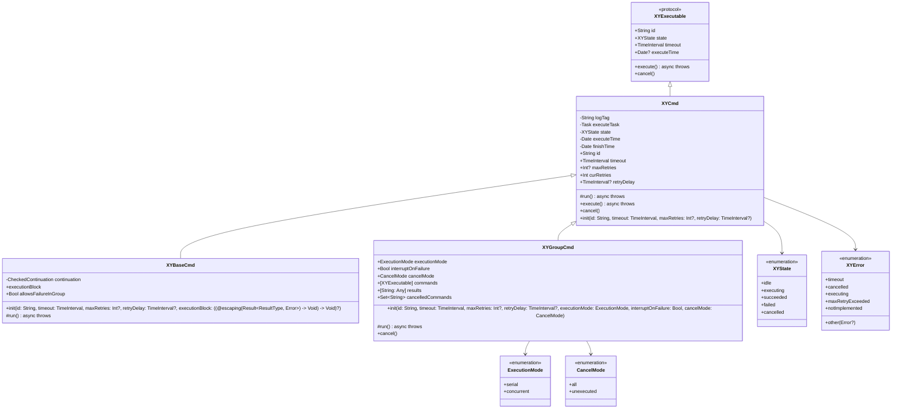

# XYWorkflow

[](https://travis-ci.org/hsf89757/XYWorkflow)
[](https://cocoapods.org/pods/XYWorkflow)
[](https://cocoapods.org/pods/XYWorkflow)
[](https://cocoapods.org/pods/XYWorkflow)

## 目录

<details>
<summary>点击展开目录</summary>

- [XYWorkflow](#xyworkflow)
  - [目录](#目录)
  - [简介](#简介)
  - [特性](#特性)
  - [架构](#架构)
  - [类图](#类图)
  - [核心类](#核心类)
    - [XYExecutable](#xyexecutable)
      - [介绍](#介绍)
      - [特点](#特点)
      - [适用场景](#适用场景)
      - [使用示例](#使用示例)
    - [XYCmd](#xycmd)
      - [介绍](#介绍-1)
      - [特点](#特点-1)
      - [适用场景](#适用场景-1)
      - [使用示例](#使用示例-1)
    - [XYBaseCmd](#xybasecmd)
      - [介绍](#介绍-2)
      - [特点](#特点-2)
      - [适用场景](#适用场景-2)
      - [使用示例](#使用示例-2)
    - [XYGroupCmd](#xygroupcmd)
      - [介绍](#介绍-3)
      - [特点](#特点-3)
      - [适用场景](#适用场景-3)
      - [使用示例](#使用示例-3)
    - [XYState](#xystate)
      - [介绍](#介绍-4)
      - [特点](#特点-4)
      - [状态说明](#状态说明)
      - [适用场景](#适用场景-4)
      - [使用示例](#使用示例-4)
    - [XYError](#xyerror)
      - [介绍](#介绍-5)
      - [特点](#特点-5)
      - [错误类型](#错误类型)
      - [适用场景](#适用场景-5)
      - [使用示例](#使用示例-5)
  - [安装](#安装)
  - [要求](#要求)
  - [作者](#作者)
  - [许可证](#许可证)

</details>

## 简介

XYWorkflow 是一个用于构建和执行工作流的 iOS 框架。它提供了一套灵活且强大的 API，用于创建、管理和执行复杂的命令序列和工作流。该框架基于 Swift Concurrency 构建，支持异步执行、超时控制、重试机制和错误处理。


## 特性

XYWorkflow 提供了丰富的功能特性，帮助开发者轻松构建和管理工作流：

- **命令模式**: 所有工作单元都遵循统一的命令协议 [XYExecutable](#xyexecutable)
- **基础命令**: [XYCmd](#xycmd) 提供了超时、状态管理、重试等通用功能
- **可执行命令**: [XYBaseCmd](#xybasecmd) 支持通过闭包快速创建可执行命令
- **分组执行**: [XYGroupCmd](#xygroupcmd) 支持多个命令的串行或并行执行
- **状态管理**: 内置 [XYState](#xystate) 状态机，跟踪命令执行状态
- **错误处理**: 完善的 [XYError](#xyerror) 错误类型系统
- **超时控制**: 每个命令支持自定义超时时间
- **重试机制**: 支持配置最大重试次数和重试延迟
- **异步支持**: 基于 Swift Concurrency 构建，充分利用 async/await 特性
- **跨平台**: 支持 iOS 和 watchOS 平台


## 架构

XYWorkflow 采用命令模式设计，所有可执行单元都遵循 [XYExecutable](#xyexecutable) 协议。核心组件包括：

1. **XYExecutable**: 所有可执行命令的基础协议
2. **XYCmd**: 命令基类，实现了超时、状态管理、重试等通用功能
3. **XYBaseCmd**: 基础命令实现，支持通过闭包快速创建命令
4. **XYGroupCmd**: 组命令，支持多个命令的串行或并行执行
5. **XYState**: 状态枚举，跟踪命令执行状态
6. **XYError**: 错误枚举，处理各种错误情况


## 类图




## 核心类

### XYExecutable

<details>
<summary>点击查看 XYExecutable 详情</summary>

#### 介绍

XYExecutable 是所有可执行命令的基础协议，定义了命令的基本属性和方法。

#### 特点

- 定义了命令的唯一标识 [id](#)
- 提供执行状态跟踪 [state](#)
- 支持超时控制 [timeout](#)
- 支持重试机制 [maxRetries](#) 和 [retryDelay](#)
- 提供执行和取消方法 [execute()](#) 和 [cancel()](#)

#### 适用场景

所有需要在 XYWorkflow 中执行的命令都必须遵循此协议。

#### 使用示例

```swift
// 遵循 XYExecutable 协议的自定义命令
class CustomCommand: XYExecutable {
    typealias ResultType = String
    
    var id: String = UUID().uuidString
    var executeTask: Task<String, any Error>?
    var executeTime: Date?
    var finishTime: Date?
    var state: XYState = .idle
    var timeout: TimeInterval = 10
    var maxRetries: Int? = 3
    var curRetries: Int = 0
    var retryDelay: TimeInterval? = 1
    
    func execute() async throws -> String {
        // 实现执行逻辑
        return "执行完成"
    }
    
    func cancel() {
        // 实现取消逻辑
    }
}
```

</details>

### XYCmd

<details>
<summary>点击查看 XYCmd 详情</summary>

#### 介绍

XYCmd 是命令的基类，实现了 XYExecutable 协议，提供了超时控制、状态管理、重试机制等通用功能。

#### 特点

- 提供完整的状态管理机制
- 内置超时控制功能
- 支持可配置的重试机制
- 提供执行前后的钩子函数
- 统一的错误处理机制

#### 适用场景

作为其他命令类的基类，提供通用的命令执行框架。

#### 使用示例

```swift
// 继承 XYCmd 创建自定义命令
class MyCommand: XYCmd<String> {
    override func run() async throws -> String {
        // 实现具体的执行逻辑
        try await Task.sleep(nanoseconds: 1_000_000_000) // 1秒
        return "任务完成"
    }
}

let command = MyCommand()
Task {
    do {
        let result = try await command.execute()
        print("执行结果: \(result)")
    } catch {
        print("执行失败: \(error)")
    }
}
```

</details>

### XYBaseCmd

<details>
<summary>点击查看 XYBaseCmd 详情</summary>

#### 介绍

XYBaseCmd 是基础命令实现，支持通过闭包快速创建可执行命令。

#### 特点

- 支持通过闭包快速创建命令
- 提供灵活的执行块配置
- 继承 XYCmd 的所有功能

#### 适用场景

适用于需要快速创建简单命令的场景。

#### 使用示例

```swift
// 使用闭包创建命令
let command = XYBaseCmd<String> { completion in
    // 执行一些异步操作
    DispatchQueue.main.asyncAfter(deadline: .now() + 2) {
        completion(.success("任务完成"))
    }
}

Task {
    do {
        let result = try await command.execute()
        print("执行结果: \(result)")
    } catch {
        print("执行失败: \(error)")
    }
}
```

</details>

### XYGroupCmd

<details>
<summary>点击查看 XYGroupCmd 详情</summary>

#### 介绍

XYGroupCmd 是组命令，支持多个命令的串行或并行执行。

#### 特点

- 支持串行和并行执行模式
- 可配置失败时是否中断执行
- 提供灵活的命令管理接口
- 支持不同的取消模式

#### 适用场景

适用于需要执行多个相关命令的场景。

#### 使用示例

```swift
// 创建多个命令
let cmd1 = XYBaseCmd<String> { completion in
    completion(.success("命令1结果"))
}

let cmd2 = XYBaseCmd<Int> { completion in
    completion(.success(42))
}

// 创建并行执行组
let group = XYGroupCmd(
    executionMode: .concurrent,
    interruptOnFailure: false
)
group.addCommand(cmd1)
group.addCommand(cmd2)

// 执行组命令
Task {
    do {
        let results = try await group.execute()
        for (id, result) in results {
            print("命令 \(id) 执行结果: \(result)")
        }
    } catch {
        print("组命令执行失败: \(error)")
    }
}
```

</details>

### XYState

<details>
<summary>点击查看 XYState 详情</summary>

#### 介绍

XYState 是状态枚举，用于跟踪命令执行状态。

#### 特点

- 定义了完整的命令生命周期状态
- 支持状态比较和哈希

#### 状态说明

- `.idle`: 初始状态
- `.executing`: 执行中
- `.succeeded`: 执行成功
- `.failed`: 执行失败
- `.cancelled`: 已取消

#### 适用场景

用于跟踪和管理命令的执行状态。

#### 使用示例

```swift
let command = XYBaseCmd<String> { completion in
    completion(.success("任务完成"))
}

print("初始状态: \(command.state)") // idle

Task {
    do {
        let result = try await command.execute()
        print("执行后状态: \(command.state)") // succeeded
    } catch {
        print("执行失败状态: \(command.state)") // failed
    }
}
```

</details>

### XYError

<details>
<summary>点击查看 XYError 详情</summary>

#### 介绍

XYError 是错误枚举，处理各种命令执行错误情况。

#### 特点

- 定义了完整的错误类型
- 支持错误比较和哈希
- 提供错误信息和代码

#### 错误类型

- `.timeout`: 命令执行超时
- `.cancelled`: 命令被取消
- `.executing`: 命令正在执行
- `.maxRetryExceeded`: 超出最大重试次数
- `.notImplemented`: 子类未实现 run 方法
- `.other(Error?)`: 其他错误

#### 适用场景

用于处理和传递命令执行过程中的各种错误。

#### 使用示例

```swift
let command = XYBaseCmd<String> { completion in
    completion(.failure(NSError(domain: "Test", code: 1, userInfo: nil)))
}

Task {
    do {
        let result = try await command.execute()
    } catch let error as XYError {
        switch error {
        case .timeout:
            print("命令执行超时")
        case .cancelled:
            print("命令被取消")
        case .other(let underlyingError):
            print("其他错误: \(underlyingError?.localizedDescription ?? "未知错误")")
        default:
            print("执行失败: \(error)")
        }
    } catch {
        print("未知错误: \(error)")
    }
}
```

</details>


## 安装

XYWorkflow 可通过 [CocoaPods](https://cocoapods.org) 安装。将以下行添加到你的 Podfile：

```ruby
pod 'XYWorkflow'
```

然后运行 `pod install`。


## 要求

- iOS 14.0+ / watchOS 9.0+
- Xcode 13.0+
- Swift 5.5+


## 作者

hsf89757, hsf89757@gmail.com


## 许可证

XYWorkflow 基于 MIT 许可证发布。有关详细信息，请参见 LICENSE 文件。

