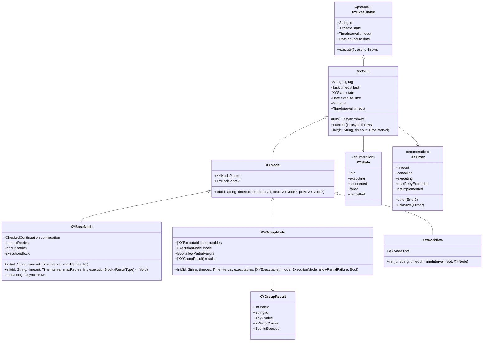

# XYWorkflow

[](https://travis-ci.org/hsf89757/XYWorkflow)
[](https://cocoapods.org/pods/XYWorkflow)
[](https://cocoapods.org/pods/XYWorkflow)
[](https://cocoapods.org/pods/XYWorkflow)

## 简介

XYWorkflow 是一个用于构建和执行工作流的 iOS 框架。它提供了一套灵活且强大的 API，用于创建、管理和执行复杂的命令序列和工作流。该框架基于 Swift Concurrency 构建，支持异步执行、超时控制、重试机制和错误处理。

## 核心特性

- **命令模式**: 所有工作单元都遵循统一的命令协议 [XYExecutable](XYWorkflow/Classes/XYExecutable.swift)
- **链式执行**: 通过 [XYNode](XYWorkflow/Classes/XYNode.swift) 实现命令链，支持顺序执行
- **分组执行**: [XYGroupNode](XYWorkflow/Classes/XYGroupNode.swift) 支持并行或串行执行多个命令
- **状态管理**: 内置 [XYState](XYWorkflow/Classes/XYState.swift) 状态机，跟踪命令执行状态
- **错误处理**: 完善的 [XYError](XYWorkflow/Classes/XYError.swift) 错误类型系统
- **超时控制**: 每个命令支持自定义超时时间
- **重试机制**: 支持配置最大重试次数
- **异步支持**: 基于 Swift Concurrency 构建，充分利用 async/await 特性
- **跨平台**: 支持 iOS 和 watchOS 平台

## 架构设计

### 核心组件

1. **XYExecutable**: 所有可执行命令的基础协议
2. **XYCmd**: 命令基类，实现了超时、状态管理等通用功能
3. **XYNode**: 节点基类，支持链式执行
4. **XYBaseNode**: 基础节点实现，提供重试机制
5. **XYGroupNode**: 组节点，支持多个命令的并行或串行执行
6. **XYWorkflow**: 工作流根节点，作为工作流的入口点

### 类图结构



### 状态管理

使用 [XYState](XYWorkflow/Classes/XYState.swift) 枚举跟踪命令执行状态：
- `.idle`: 初始状态
- `.executing`: 执行中
- `.succeeded`: 执行成功
- `.failed`: 执行失败
- `.cancelled`: 已取消

### 错误处理

通过 [XYError](XYWorkflow/Classes/XYError.swift) 枚举处理各种错误情况：
- `.timeout`: 命令执行超时
- `.cancelled`: 命令被取消
- `.executing`: 命令正在执行中
- `.maxRetryExceeded`: 超出最大重试次数
- `.notImplemented`: 子类未实现 run 方法
- `.other(Error?)`: 其他错误
- `.unknown(Error?)`: 未知错误

## 安装

XYWorkflow 可通过 [CocoaPods](https://cocoapods.org) 安装。将以下行添加到你的 Podfile：

```ruby
pod 'XYWorkflow'
```

然后运行 `pod install`。

## 使用示例

要运行示例项目，请克隆仓库并首先从 Example 目录运行 `pod install`。

### 基本用法

```swift
// 创建一个基础节点（通过继承）
class ExampleNode: XYBaseNode<String> {
    private let work: () -> String
    
    init(work: @escaping () -> String) {
        self.work = work
        super.init()
    }
    
    override func runOnce() async throws -> String {
        // 模拟一些异步工作
        try await Task.sleep(nanoseconds: 1_000_000_000) // 1秒
        return work()
    }
}

let node = ExampleNode { "任务完成" }

// 或者直接使用闭包创建节点（新增方式）
let nodeWithClosure = XYBaseNode<String> { completion in
    // 执行一些异步操作
    DispatchQueue.main.asyncAfter(deadline: .now() + 2) {
        completion(.success("任务完成"))
    }
}

// 执行命令
Task {
    do {
        let result = try await node.execute()
        print("执行结果: \(result)")
        
        let result2 = try await nodeWithClosure.execute()
        print("闭包节点执行结果: \(result2)")
    } catch {
        print("执行失败: \(error)")
    }
}
```

### 链式执行

```swift
// 创建多个节点
let node1 = XYBaseNode<String> { completion in
    completion(.success("节点1结果"))
}

let node2 = XYBaseNode<String> { completion in
    completion(.success("节点2结果"))
}

let node3 = XYBaseNode<String> { completion in
    completion(.success("节点3结果"))
}

// 链接节点
node1.next = node2
node2.prev = node1

node2.next = node3
node3.prev = node2

// 创建工作流
let workflow = XYWorkflow(root: node1)

// 执行工作流
Task {
    do {
        try await workflow.execute()
        print("工作流执行完成")
    } catch {
        print("工作流执行失败: \(error)")
    }
}
```

### 分组执行

```swift
// 创建多个命令
let cmd1 = XYBaseNode<String> { completion in
    completion(.success("命令1结果"))
}

let cmd2 = XYBaseNode<Int> { completion in
    completion(.success(42))
}

// 创建并行执行组
let group = XYGroupNode(
    executables: [cmd1, cmd2],
    mode: .concurrent,
    allowPartialFailure: false
)

// 执行组命令
Task {
    do {
        let results = try await group.execute()
        for result in results {
            print("索引 \(result.index) 的命令 \(result.id) 执行结果: \(result.value ?? "nil")")
        }
    } catch {
        print("组命令执行失败: \(error)")
    }
}
```

## 要求

- iOS 14.0+ / watchOS 9.0+
- Xcode 13.0+
- Swift 5.5+

## 作者

hsf89757, hsf89757@gmail.com

## 许可证

XYWorkflow 基于 MIT 许可证发布。有关详细信息，请参见 LICENSE 文件。